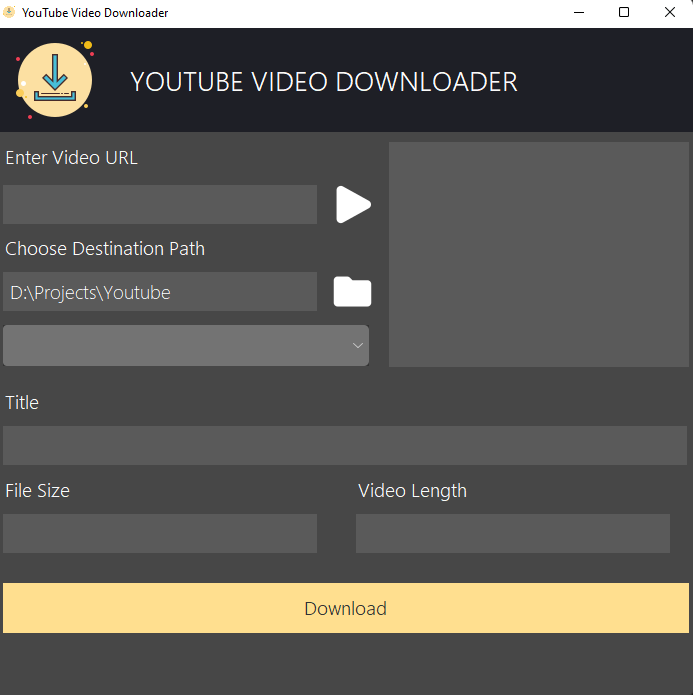

# YOUTUBE VIDEO DOWNLOADER

> Simple youtube video downloader in different resolutions.

## Preview

## How To RUN ?

1. Make sure you have already downloaded and installed python on your system.
2. Then, download this repo on your local machine.
3. Then, run following command to install pytube package used in this project. 
&nbsp;`pip install pytube`
4. Now, Run your mail file i.e main.py using command  
&nbsp;`python main.py`
5. Now you can paste any youtube video link and download that video.

